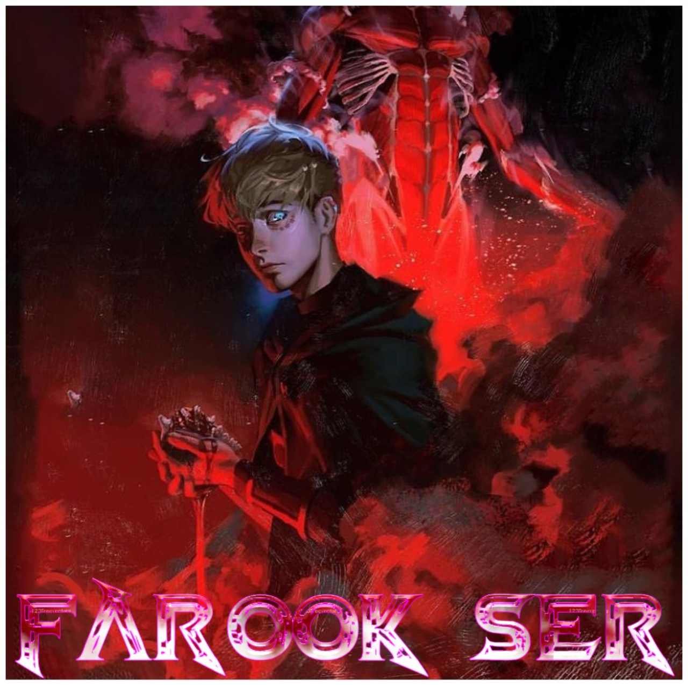

<div align="center">

## [](https://git.io/typing-svg)

 </a>
  
  <p align="center">
<a href="#"></a>
</p>
  <p align="center">
<a href="https://github.com/farookser-v1"></a>
</p>
</div>
<p align="center">
Project created by <a href="https://github.com/farookser-v1">farookser-v1</a> to make it public
    <br>
       | © |
        Reserved |
    <br> 
</p>


## Setup
<div align="center">

  ### Simple Method
  
[](https://heroku.com/deploy?template=https://github.com/farookser-v1/lisa-mwol) 
  
[](https://replit.com/@Farhandqz/JulieMwol)

  <a href="https://youtu.be/0pU8N611-Oc">
<br>
### The Hard Method
```js
GET QR
$ apt install git
$ apt install nodejs --fix-missing
$ git clone https://github.com/farookser-v1/lisa-mwol
$ cd lisa-mwol
$ npm install @adiwajshing/baileys
$ npm install chalk
$ node Fidha.js
```
      
```js
SETUP
$ git clone https://github.com/farookser-v1/lisa-mwol
$ cd lisa-mwol
$ npm i
$ node Fidha.js
```

----

  <p align="center">
  <a href="httsp://github.com/farookser-v1/lisa-mwol">
    
<a href="https://github.com/farookser-v1/followers">

<p align="center">
<a href="https://github.com/farookser-v1/followers"
</a>
<a href="https://github.com/farookser-v1/lisa-mwol/stargazers/"></a>
<a href="https://github.com/farookser-v1/lisa-mwol/network/members"></a>
<a href="https://github.com/farookser-v1/lisa-mwol/watchers"></a>
</p>

## 📢 Guide
Any doubt click wa logo👇
    <br>
<br>
  <a href="https://wa.me/+527777143999"></a>
  <div align="center">
       
  [](https://github.com/farookser-v1/lisa-mwol)
  </div>
    
### ⚠️ Warning! 
```
Due to Userbot; Your WhatsApp account may be banned.
This is an open source project, you are responsible for everything you do. 
Absolutely, Hyper executives do not accept responsibility.
By establishing the Hyper, you are deemed to have accepted these responsibilities.
```

## Developers
  <div align="center">
    
  [](https://github.com/farhan-dqz) | [](https://github.com/farookser-v1) |  [](https://github.com/afnanplk) | [](https://github.com/farookser-v1) 
----|----|----|----
[farhan-dqz](https://github.com/farhan-dqz) | [farookser-v1](https://github.com/farookser-v1) | [afnanplk](https://github.com/afnanplk) | [farookser-v1](https://github.com/farookser-v1) 
Developer, Modifying as Public | Re-Developer, Bug Fixes, Modules, Commits |  Bug Fixes, Modules | Bug Fixes, Commits
  </div>
    


## License
This project is protected by `GNU General Public Licence v3.0` license.

### Disclaimer
`WhatsApp` name, its variations and the logo are registered trademarks of Facebook. We have nothing to do with the registered trademark
